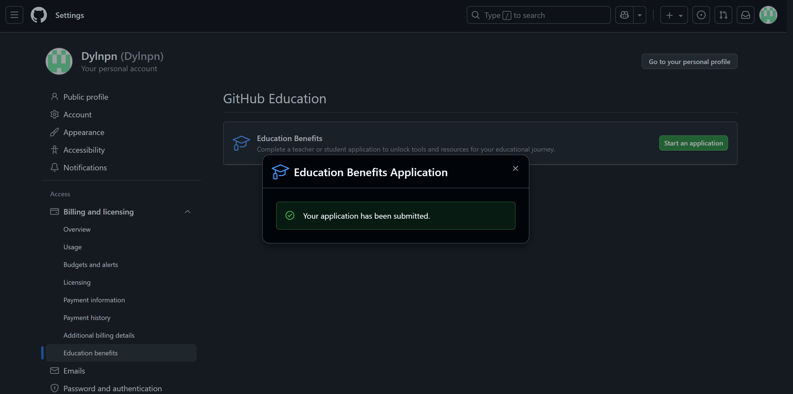
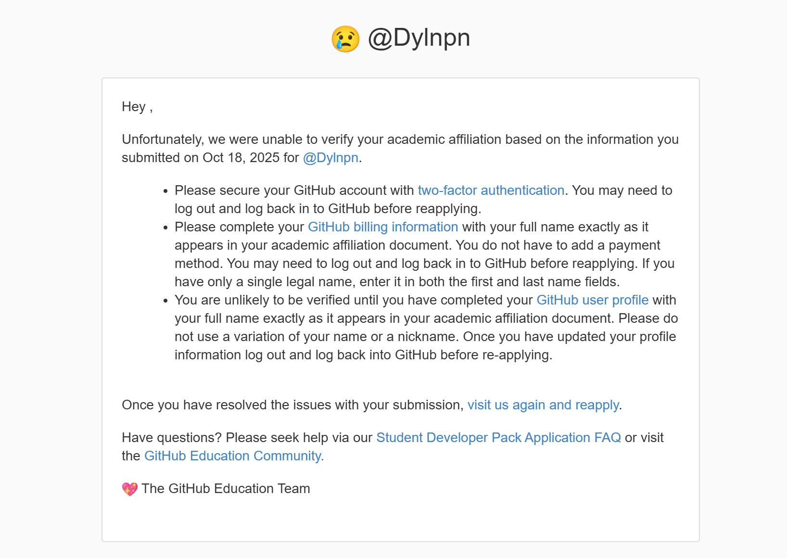
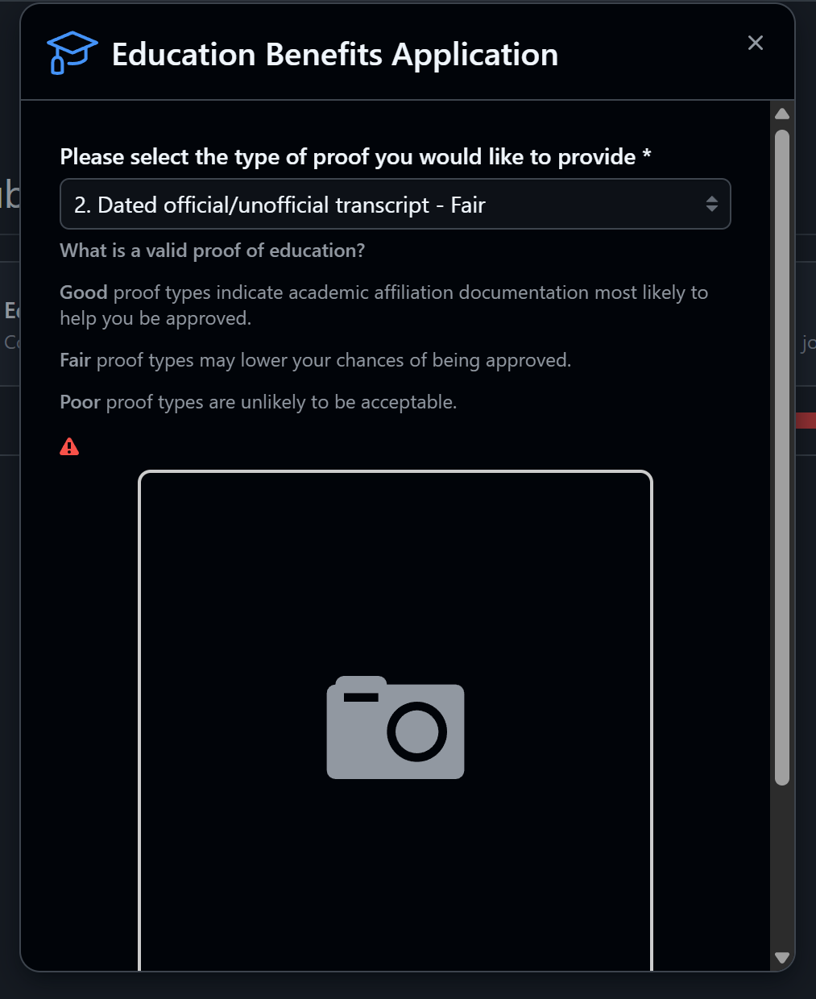
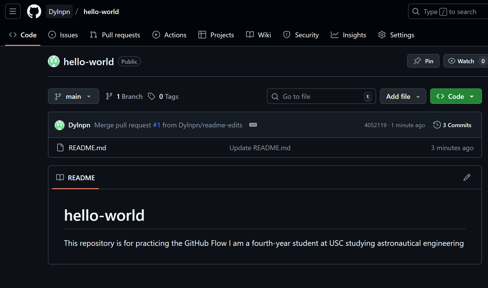
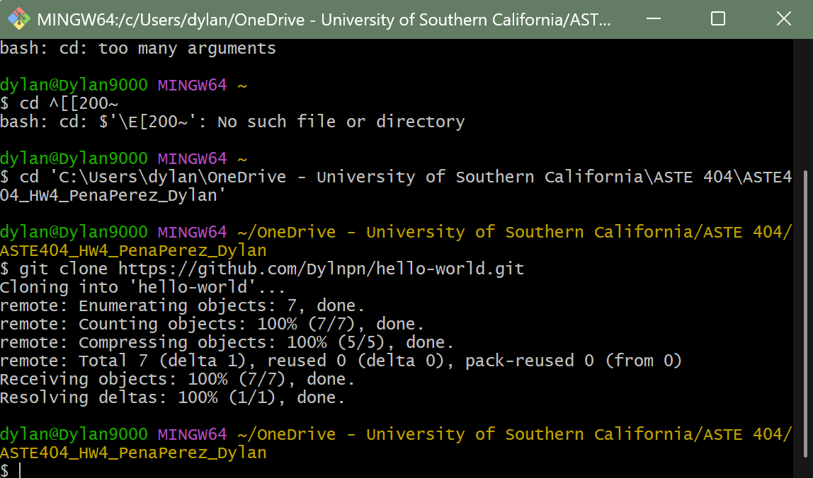
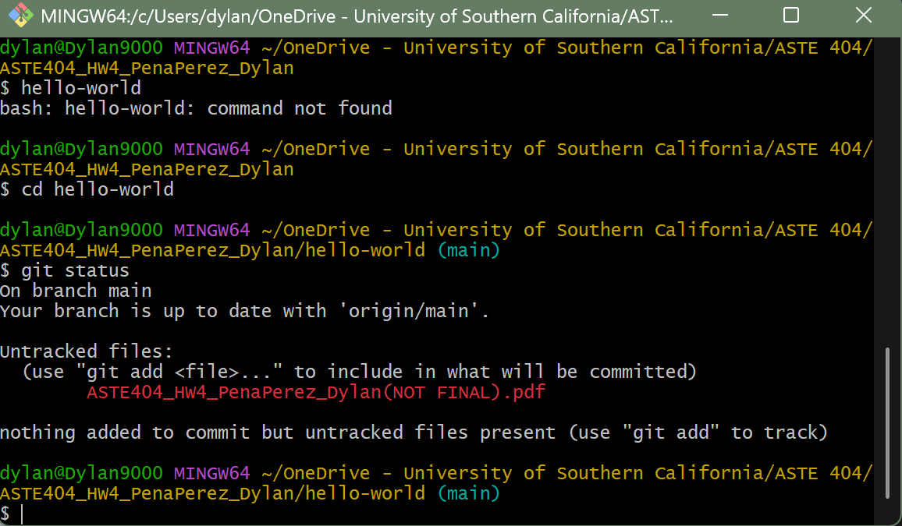
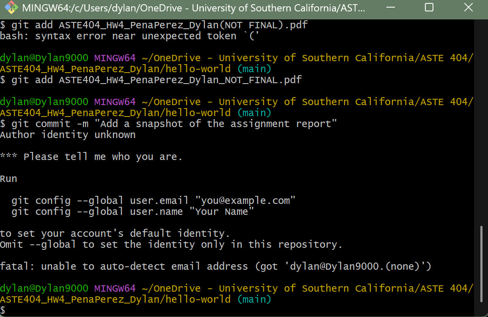
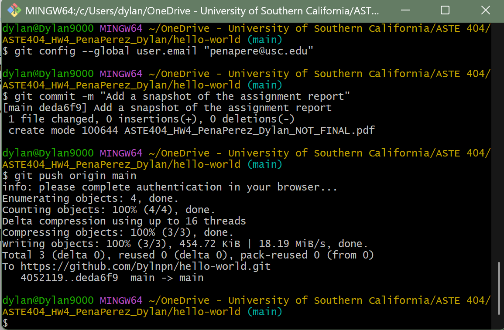

# hello-world
This repository is for practicing the GitHub Flow

## Author
Dylan Pena Perez - Fourth-year student at USC studying Astronautical Engineering

Edited on VS Code.

## Final Report (Homework #4 - ASTE 404)

## Github Education
- The Education application was submitted on GitHub.

- Got denied.

- Fixed my profile but cannot apply again. When I try to submit another application with a screenshot of my transcript, I get the following:
 

***Unsure what this means. But I will give it a couple of days before I apply again and see if this issue comes up again.***

## Repository Practice
- Created Repository and practiced branching: 

## Why Use Git and Version Control? 
Version control is useful because it keeps a history of every change, allowing teams to compare versions, go back to prior work safely, and coordinate additions without overlapping. Source Code Management is essentially the same, tracking a log that is always changing, preventing overwrites and conflicts with merging. This is important for projects and teams of scalable size. 
Git is the open-source distribute VCS, as the working copy is a full repository with efficient content storage. Git has great performance, security, and flexibility.  

## Installing Git 
Installed successfully: 

Git Clone: 

Git clone was successful. 
I then added my PDF file to the hello-world repository from my computer. 
When trying to commit my changes I got the following: 

Had to enter my identity using my email and then I was able to commit and push my changes. 

## VS Code
Successfully integrated Git in VS Code. Now, I will provide instructions on how to change, stage, commit, and push changes into my “Hello World” repo through VS code.  
1. Open folder on VS Code where your repo is located. 
2. Click on source control (looks like a branch). 
3. Ctrl + P, and look up file 
4. Edit file and Ctrl + S 
5. Open Git Bash 
6. cd 'C:\Users\dylan\OneDrive - University of Southern California\ASTE 
404\ASTE404_HW4_PenaPerez_Dylan\hello-world' 
7. $ git config --global user.email penapere@usc.edu 
8. $ git config --global user.name dyln.pn 
9. Then you can commit changes on VS Code 
10. Merge the new branch with main branch 
11. Upload to Git Hub 
12. And then accept changes on Git Hub! 